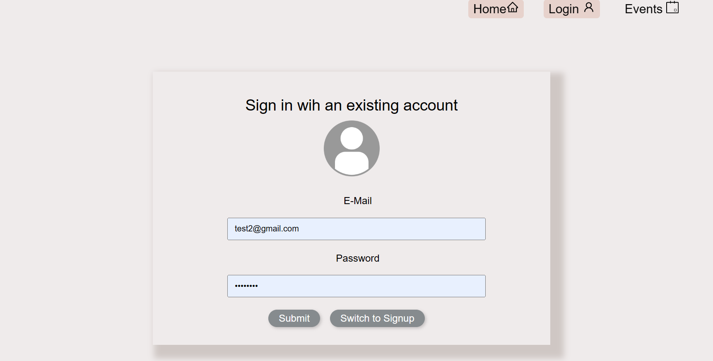
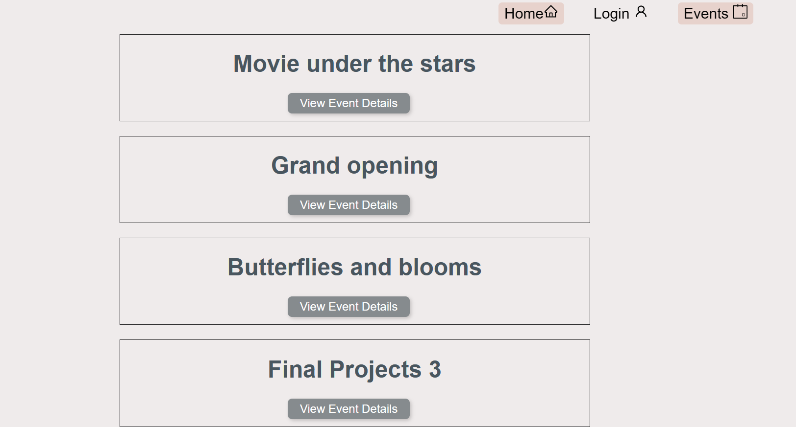
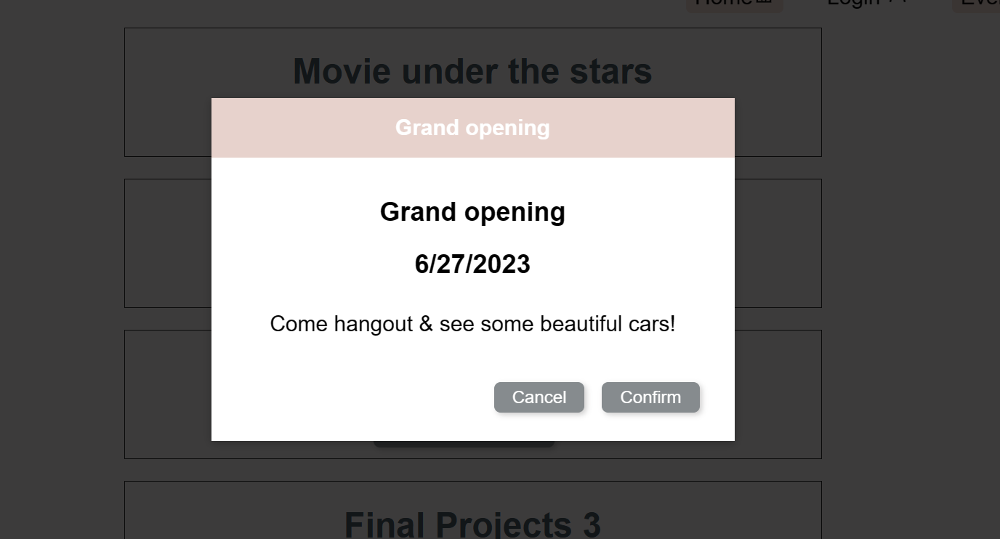
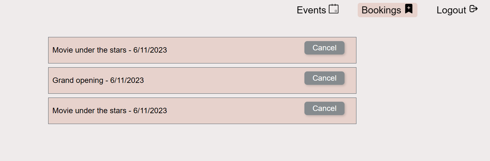

# Event Planner

Event Planner is a web application that allows users to create, manage, and organize events. It provides features for event creation, listing, editing, and deletion, as well as user registration and authentication.

## Application link
The application has been deployed to Heroku,
 [Click here to visit the live deployed site]()!

 

 

 

 

 

## Features

- User registration and authentication
- Event creation with details like title, description, date, and location
- Event listing and search functionalities
- Event details view with the ability to edit or delete events
- RSVP functionality for users to indicate their attendance
- Polished user interface with a responsive design

## Technologies Used

- Front-end: React, HTML, CSS
- Back-end: Node.js, Express.js
- Database: MongoDB with Mongoose
- GraphQL for querying and mutating data
- Deployment: Heroku

## Installation

1. Clone the repository:

   ```shell
   git clone <repository-url>
   ```

2. Install the dependencies for the front-end and back-end:

   ```shell
   cd frontend
   cd events-app
   npm install
   npm start
   ```

3. Configure the environment variables:
   - Create a `.env` file in the project's root directory and provide the necessary environment variables for the server (e.g., database connection string, JWT secret).

4. Start the development server:

   ```shell
   npm run dev
   ```

5. Access the application locally by visiting `http://localhost:3000` in your browser.

## Deployment

The application can be deployed using Heroku. Follow these steps to deploy:

1. Create a new Heroku app from the Heroku Dashboard or using the Heroku CLI.

2. Set up the necessary environment variables on your Heroku app (e.g., database connection string, JWT secret).

3. Push the code to your Heroku app's repository:

   ```shell
   git push heroku main
   ```

4. Heroku will automatically build and deploy the application.

5. Once the deployment is complete, you can access the deployed application using the provided Heroku URL.

## Developers
[Maha Abdelnabi](https://github.com/Maha-Abdelnabi)

[Somayyah Maqsudi](https://github.com/SomayyahMaqsudi)

[Tien Ton](https://github.com/TimothyLai1121)

[Brian Lucy](https://github.com/BrianLucy)

[Brenden Thomas](https://github.com/mightjustdie)

[Imani Santana](https://github.com/Santanaco)


## License
This project is licensed under the MIT License - [](https://opensource.org/licenses/MIT)
